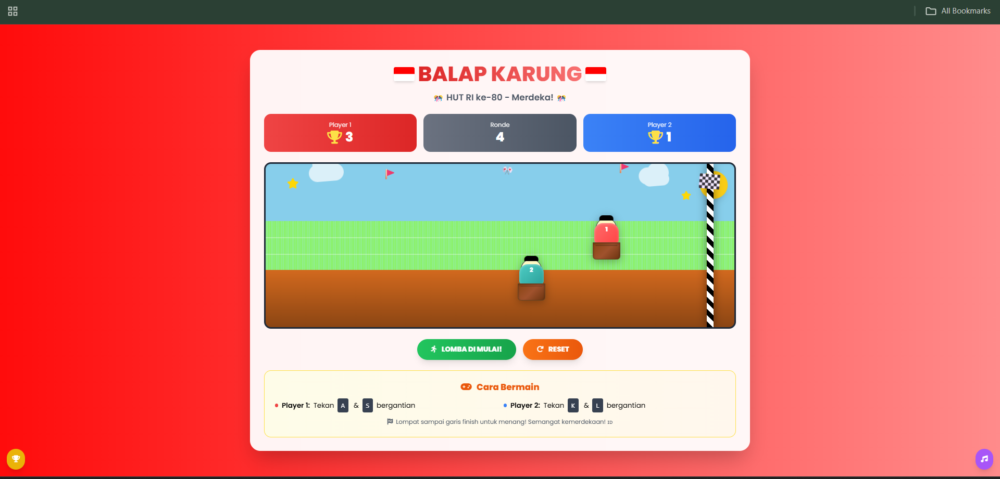

# game-balap-karung
Memperingati HUT RI ke 80 Merdeka!!^^
https://hilal5.github.io/game-balap-karung/
# Balap Karung – HUT RI ke-80

Game mini 2-pemain bertema 17 Agustusan. Tekan tombol secara bergantian untuk membuat karakter melompat hingga garis finish. Ringan, tanpa build tools — cukup buka **index.html** di browser.



## Cara Main
- **Player 1:** tekan `A` dan `S` **bergantian**  
- **Player 2:** tekan `K` dan `L` **bergantian**  
- **Mobile:** gunakan tombol A/S (Player 1) dan K/L (Player 2) di layar
- Klik **MULAI LOMBA!** untuk memulai, **RESET** untuk memulai game baru

## Fitur
- 2 pemain di satu keyboard
- Power-up ⭐ dengan efek boost
- Efek suara menggunakan **Web Audio API** (tanpa file audio)
- Animasi confetti & kembang api saat menang
- Papan skor sederhana (in-memory)
- Tombol musik & modal pemenang

## Struktur Proyek
```
.
├── index.html     # halaman utama
├── style.css      # gaya & animasi kustom
├── script.js      # logika game
└── s1.png # screenshot 
```

---
Selamat bermain & merdeka! 🇮🇩
